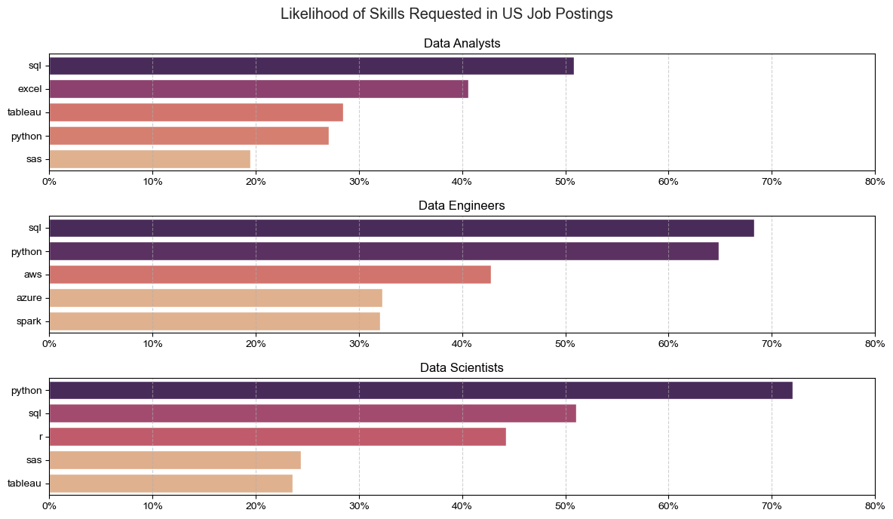
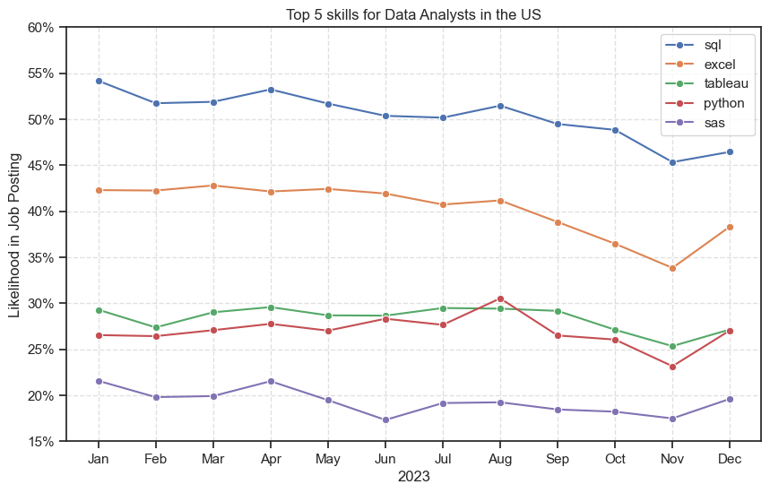
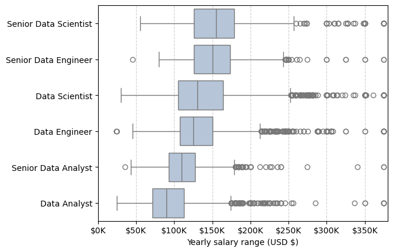
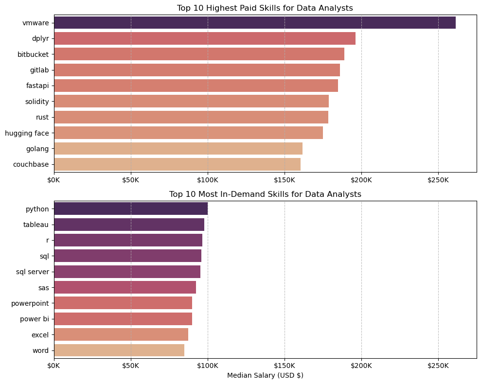
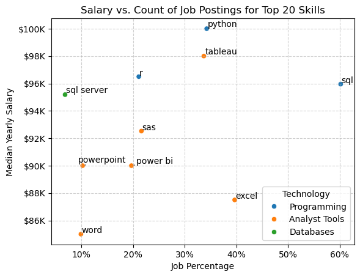

# Data Jobs Python Analysis

## Overview
In-depth analysis of a dataset focused on analytics, engineering, and data science positions. The resulting plots aim to answer questions such as which technology is most in demand, along with a comparison of median salaries and an analysis of market trends throughout 2023. The dataset was sourced from [Hugging Face](https://huggingface.co/datasets/lukebarousse/data_jobs), and since the US was the country with more job postings, most results where filtered for it.

## Technical Details
- **Python**: The main programming language utilized during the project development. The following libraries were used:

    - **Pandas**: Utilized to clean and transform the data, along with calculations and aggregations for different analysis.
    - **Matplotlib**: Main library I used to plot most graphs at the begging, also functioning as a backbone for Seaborn later on.
    - **Seaborn**: Alternative for Matplotlib, better for overall plot customization and coloring.

## Data Cleaning and Standardization
Before any analysis and/or calculation began, the data was cleansed equally on each notebook, ensuring standardization for the best results without inconsistencies.

```python
import pandas as pd
import matplotlib.pyplot as plt
import seaborn as sns
import ast
from datasets import load_dataset

# load data
ds = load_dataset("lukebarousse/data_jobs")
df = ds["train"].to_pandas()

# clean data
df["job_posted_date"] = pd.to_datetime(df["job_posted_date"])
df["job_skills"] = df["job_skills"].apply(lambda skill: ast.literal_eval(skill) if pd.notna(skill) else skill)
```

## Insights Found

### 1 - Most demanded job skills



### Findings
- Python and SQL are the most requested languages ​​for the vast majority of positions.
- Other requirements vary between Tools and Cloud for engineer and scientist positions.
- Excel is among the most requested tools only for the Data Analyst position.

### 2 - Data Analyst skills throughout the year



### Findings
- Most of the skills requested throughout the year maintained a consistent level.
- The peak was at the beginning of the year, slowly declining as the months passed.
- The trend is for all requested skills to return to their peak at the beginning of the following year, with a visible increase already in December.

### 3 - Salary distribution between most common roles and their senior counterparts



### Findings
- As expected, senior positions have higher average salaries than their respective junior and mid-level counterparts.
- Even at the senior level, senior data analysts still earn less than engineers and scientists with less experience.
- There is a very large number of outliers in all 6 positions analyzed. As shown in the graph below (DA only), there are positions that pay very well but require more niche skills.



### 4 - Salary and job postings quantity relation



### Findings
- Filtering by data analysts, Python is one of the most requested and highest-paid skills, along with SQL.
- The main tools of the Microsoft 365 (Word, PowerPoint, and Excel) are also present, with Excel standing out in terms of salary.
- SQL Server proves to be the industry standard, being the only specific SQL version requested for the top 10 most common DA skills.